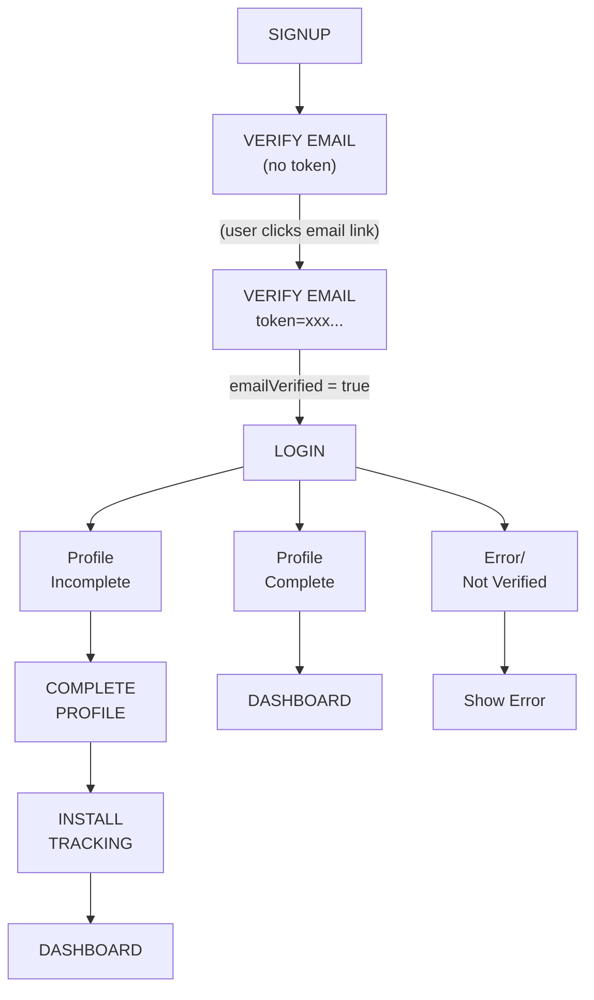

```mermaid
flowchart TD
    signup["SIGNUP"] --> verify1["VERIFY EMAIL<br/>(no token)"]
    verify1 -- "(user clicks email link)" --> verify2["VERIFY EMAIL<br/>token=xxx..."]
    verify2 -- "emailVerified = true" --> login["LOGIN"]

    login --> incomplete["Profile<br/>Incomplete"]
    login --> complete["Profile<br/>Complete"]
    login --> error["Error/<br/>Not Verified"]

    incomplete --> completeProfile["COMPLETE<br/>PROFILE"] --> tracking["INSTALL<br/>TRACKING"] --> dashboard1["DASHBOARD"]
    complete --> dashboard2["DASHBOARD"]
    error --> showError["Show Error"]


```

